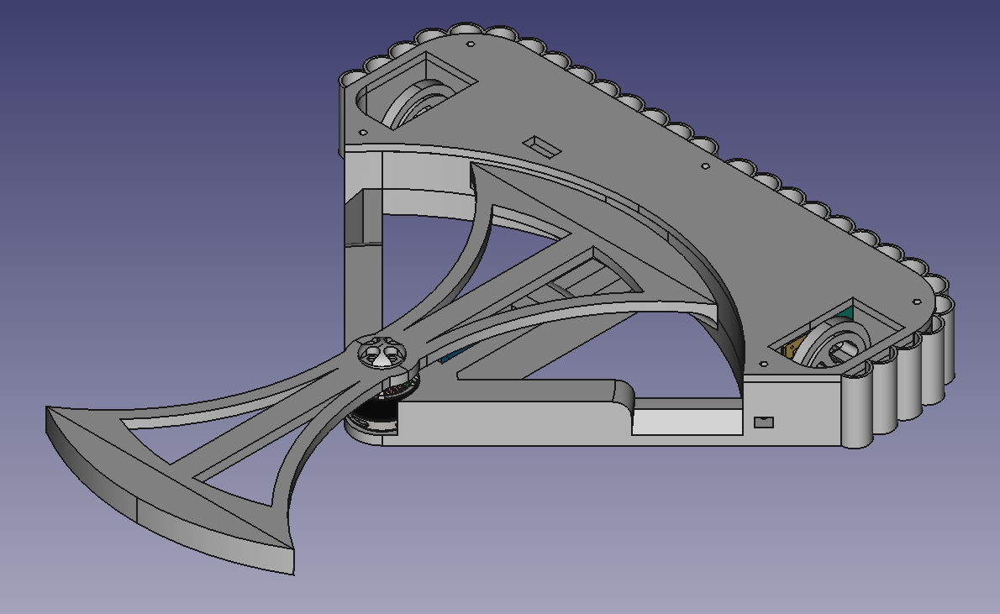
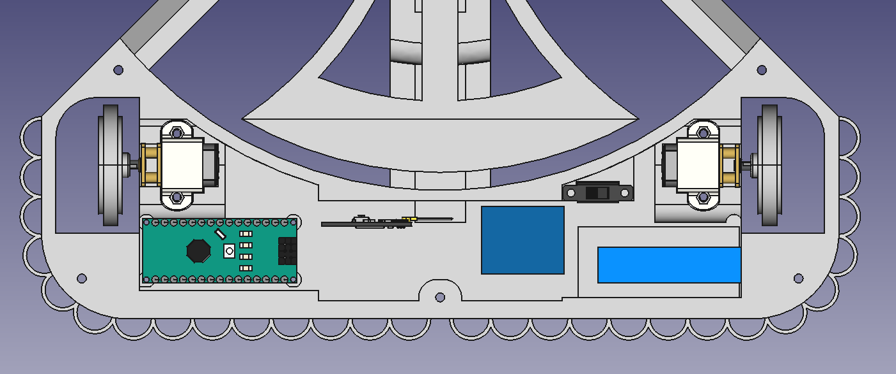

# BattleBot-AntEater-MK2
 A battle bot for combat robotics. Chassis created using FreeCAD 0.21.2

 Download printable files from the [releases section](https://github.com/OfficialGamersIncorporated/BattleBot-AntEater-MK2/releases)

 Features:
 * 3D printable.
 * Active horizontal spinner weapon.
 * Reversability (can drive upside-down.)
 * Protective honeycomb armor on the rear (battle tested.)
 * Mounting point for an optional Arduino Nano.
 * Hole in lid for easy access to power switch with a screwdriver.

 Known flaws:
 * The wheels fall off when hit hard enough.
 * The weapon is prone to shattering.

 Notes for Mk3:
 * Reduce space around wheels to prevent them from falling off.
 * Strenghten spinner weapon, especially against off-axis attacks.
 * Increase vehicle clearance to avoid getting stuck on debris.
 * Make battery charge cable accessable without removing the lid.

 ## Parts
 * Bristol Bot Builder's ant-weight drive kit: https://shop.bristolbotbuilders.com/product/antkit/
 * Bristol Bot Builder's ant-weight spinner electronics: https://shop.bristolbotbuilders.com/product/spinner/
 * An Arduino Nano (optional.)
 * 4x 1.6M screws for holding in the optional Arduino Nano.
 * 2x 2M screws for holding in the switch.
 * 5x 2.5M screws for holding the lid shut.

 ## Images
 
 